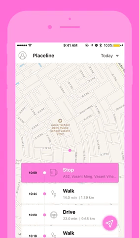
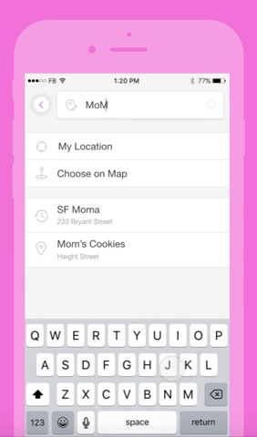

<a href="https://hypertrack.com/">
    
</a>

Live Location Sharing and Activity Tracking 
===========================================

[](https://opensource.org/licenses/MIT) [](https://opensource.org/licenses/MIT)  [](http://slack.hypertrack.com)


This open source repo uses [HyperTrack](https://www.hypertrack.com) for live location sharing and activity tracking.
Hypertrack live helps you share your live location with friends through your favorite messaging app when on the way to meet up. You can also see your activities organized as chronological cards so that tapping on each card gives you the locations of the activity. 

- [Placeline](#placeline)
- [Live Location Sharing](#live-location-sharing)
- [Usage](#usage)
- [Build Placeline in your app](#build-placeline-in-your-app)
- [Build Live Location Sharing in your app](#build-live-location-sharing-using-hypertrack-in-30-minutes)
- [Documentation](#documentation)
- [Contribute](#contribute)
- [Support](#support)


## Placeline
One of the core feature of Hypertrack Live is Placeline. Placeline is useful in tracking your daily activity with near-zero battery impact. You will feel the magic of automatic in its ability to use GPS, WiFi, network, accelerometer, pedometer, gyroscope and other sensors to deliver accuracy.



The  Placeline is powered by HyperTrack mobile SDK which collects location and activity data for your users. It includes segments like stop, walk, and drive. 

## Live Location Sharing
The other important feature of Hypertrack Live powered by hypertrack SDK is Live Location Sharing. 
Live Location Sharing has become a primary need for many consumer apps. Especially it can improve the user experience a lot when the transaction starts online but requires people to meet offline. It helps you in solving the daily anxiety of “where are you?”.

 


## Usage
#### To use this app

```bash
# Clone this repository
$ git clone https://github.com/hypertrack/hypertrack-live-ios.git

# Go into the repository
$ cd hypertrack-live-ios/htlive-ios

# Install dependencies
$ pod install
```

Get your HyperTrack API keys [here](https://dashboard.hypertrack.com/signup), and add the publishable key to setUpHypertrack function in [HyperTrackAppService.swift](https://github.com/hypertrack/hypertrack-live-ios/blob/master/htlive-ios/htlive-ios/HyperTrackAppService.swift) file.
```swift
        HyperTrack.initialize("YOUR_PUBLISHABLE_KEY")
```

#### To build live location sharing follow this [tutorial](#build-live-location-sharing-using-hypertrack-in-30-minutes).
#### To build placeline in your app follow this [tutorial](#build-placeline-in-your-app).


## Build Placeline in your app 
 - [Placeline Format](#placeline-format)
 - [Setup](#setup)
 - [Create a Hypertrack User](#create-a-hypertrack-user)
 - [Get Placeline in your app](#get-placeline-in-your-app)


### Placeline Format
Placeline object contains a lots of detailed information about the activity like the start time, end time, location.
An example JSON representation is given below.
```json
[
    {
        "time_aware_polyline": "aiseFr_ajVcs{ykxAAA????fA{A????LO????l@t@????r@bA????PT????HL????r@`A????`CcDA",
        "distance": 310.47333797811655,
        "user_id": "4e2a8344-9864-4473-864f-e223dec208b3",
        "type": "trip",
        "encoded_polyline": "aiseFr_ajVAA??fA{A??LO??l@t@??r@bA??PT??HL??r@`A??`CcD",
        "activity": "Walk",
        "duration": 95738.982,
        "ended_at": "2017-07-14T02:41:01.739000+00:00",
        "started_at": "2017-07-13T00:05:22.757000+00:00",
        "trip_id": "5c7a0e2e-35ce-4482-baa3-34f837146071",
        "id": "5c7a0e2e-35ce-4482-baa3-34f837146071_1499904322"
    },
    {
        "id": "885cb75c-c642-4df2-9d0e-8b9bf0d9547b",
        "user_id": "4e2a8344-9864-4473-864f-e223dec208b3",
        "place": {
            "id": "83f46d89-cacd-4a1a-9007-507dbd5a4d7c",
            "name": "",
            "location": {
                "type": "Point",
                "coordinates": [-122.3985203814826,
                    37.7869638230917
                ]
            },
            "address": "182 2nd St, San Francisco, CA 94105, USA",
            "locality": "South Beach",
            "landmark": "",
            "zip_code": "94105",
            "city": "SF",
            "state": "CA",
            "country": "US"
        },
        "started_at": "2017-07-14T02:41:02.046000Z",
        "ended_at": null,
        "duration": 3211.898782,
        "lookup_id": "D2E0C7FD-D1D3-4C1E-9307-82AD6F70BC9D",
        "step_count": 301,
        "step_distance": 210,
        "created_at": "2017-07-14T02:41:02.409459Z",
        "modified_at": "2017-07-14T02:41:02.409487Z",
        "type": "stop"
    }
]
```
### Setup
Set up HyperTrack by following the instructions from [here](https://docs.hypertrack.com/sdks/ios/setup.html).

#### Create a HyperTrack User
The next  thing that you need to do is create a Hypertrack User. It helps Hypertrack to tag the location/activity data of a user and in turn help us to share status of your live location to your friends. More details about the function is present here(https://docs.hypertrack.com/sdks/ios/basic.html#step-1-create-sdk-user). 

```swift
     HyperTrack.getOrCreateUser(userName, _phone : "", "") { (user, error) in
                
                if (error != nil) {
                    // Handle error on get or create user
                    return
                }
                
                if (user != nil) {
                    // User successfully created
                    print("User created:", user!.id ?? "")
                    HyperTrack.startTracking()
                   }
                }
            }
```
### Get Placeline in your app
Once the user is created you just have to implement the below function and you are all set to use the rich activity data in your app.

```swift
 HyperTrack.getPlaceline { (placeLine, error) in
            guard let fetchedPlaceLine = placeLine else { return }
            if let segments = fetchedPlaceLine.segments {
                // process the segment
            
            }
            
        }
```


## Build Live Location Sharing using HyperTrack in 30 Minutes


Use the following tutorial to build  live location sharing feature in your app.

- [Steps](#setup)
  - [Get API Keys](#step-1-get-api-keys)
  - [Use Starter Project](#step-2-use-starter-project)
  - [Setup HyperTrack SDK](#step-3-setup-hypertrack-sdk)
  - [Create a HyperTrack User](#step-4-create-a-hypertrack-user)
  - [Show Live Location View](#step-5-show-live-location-view)
  - [Create And Track Action](#step-6-create-and-track-action)
  - [Share Your Trip](#step-7-share-your-trip)
  - [Tracking an Ongoing Live Location Trip](#step-8-tracking-an-ongoing-live-location-trip)
  - [Join the Trip](#step-9-join-the-trip)

  
### Steps 

#### Step 1. Get API Keys
Get your HyperTrack API keys [here](https://dashboard.hypertrack.com/signup).

#### Step 2. Use Starter Project
We have created a starter project so that building Live Location Sharing becomes very easy and quick. It will prevent you from the hassle of creating a new project and the workflow to enable live location sharing. If you want to directly build the flow in your own app or wanted to create a new project, you can ignore this step.

```bash
# Clone this repository
$ git clone https://github.com/hypertrack/hypertrack-live-ios.git

# Go into the starter folder in the repository
$ cd hypertrack-live-ios/starter/

# Install dependencies
$ pod install
```

#### Step 3. Setup HyperTrack SDK
If you are not using the starter project set up HyperTrack by following the instructions from [here](https://docs.hypertrack.com/sdks/ios/setup.html). Otherwise initialize the SDK by putting the following code in AppDelegate
```swift
// AppDelegate.swift
        HyperTrack.initialize("YOUR_PUBLISHABLE_KEY")
        HyperTrack.requestAlwaysAuthorization()
        HyperTrack.requestMotionAuthorization()
```
 in the following function like : 

```swift
 func application(_ application: UIApplication, didFinishLaunchingWithOptions launchOptions: [UIApplicationLaunchOptionsKey: Any]?) -> Bool {
        
        // Step 3: initialize hypertrack sdk and request for permissions here
        HyperTrack.initialize("pk_e956d4c123e8b726c10b553fe62bbaa9c1ac9451")
        HyperTrack.requestLocationServices()
        return true
    }
```

#### Step 4. Create a HyperTrack User
The next  thing that you need to do is create a Hypertrack User. It helps Hypertrack to tag the location/activity data of a user and in turn help us to share status of your live location to your friends. More details about the function is present here(https://docs.hypertrack.com/sdks/ios/basic.html#step-1-create-sdk-user). 

For starter project go to UserProfileViewController.swift. When the user press login, take the name of the user and use the below function to create a user.

```swift
     HyperTrack.getOrCreateUser(userName!, _phone : "", "") { (user, error) in
                
                if (error != nil) {
                    // Handle error on get or create user
                    return
                }
                
                if (user != nil) {
                    // User successfully created
                    print("User created:", user!.id ?? "")
                    HyperTrack.startTracking()
                     self.showAlert(title:"Step 4  completed", message: "Yay Hypertrack User is Created",buttonTitle: "OK,                       What's Next ?" ){(action) in
                        self.dismiss(animated:true, completion: nil)
                    }

                }
            }
```


#### Step 5. Show Live Location View
Now since we have a Hypertrack User, we can start a live location view to him so that he can choose a location where he wants to go. This view is a combination of location picker and a map view. Once the user selects a location with the help of our inbuilt location picker, than the sdk gives a callback to the app with the selected location so that the app can start a trip. 

For starter project go to ShareLiveLocationVC.swift. Embed the live location view in your ViewController's view. This should be done in - override 'func viewDidAppear(_ animated: Bool)'

```swift
        // get an instance of hypertrack's map view (it's a location picker + map view)
        hyperTrackMap = HyperTrack.map()
        // enable live location sharing 
        hyperTrackMap?.enableLiveLocationSharingView = true
        hyperTrackMap?.showConfirmLocationButton = true
        // gives callbacks when a user interacts with the map, like when he selects a location or press a refocus button
        hyperTrackMap?.setHTViewInteractionDelegate(interactionDelegate: self)
        if (self.hypertrackView != nil) {
            hyperTrackMap?.embedIn(self.hypertrackView)
        }
  ```

Create an extension to handle interaction delegate callback , and implement functions which are of interest to you.
For starter project , it is already there so nothing to do here.
``` swift
 extension ShareLiveLocationVC:HTViewInteractionDelegate {
 }
```

Implement this function in the above extension. You will get a callback when a user selects a location.
```swift
// HTViewInteractionDelegate callback when user selects a location, good place to start your action
 func didSelectLocation(place : HyperTrackPlace?){
    
 }
```
#### Step 6. Create and Track Action
In Hypertrack's terminology, an Action is a pickup, delivery, visit or any other transaction event being performed by the User. When a user decides to start sharing his location, then you should create and action and assign to him. 
A lookpupId is an identifier created by you for the live location trip. We chose it to be the UUID. You can use your own internal identifiers. A lookupId is what needs to be shared to the other person , so they can join your trip and share there location.

For starter project goto ShareLiveLocationVC.swift and add the below code when you get a callback of location selection.
```swift
        let htActionParams = HyperTrackActionParams()
        htActionParams.expectedPlace = place
        htActionParams.type = "visit"
        htActionParams.lookupId = UUID().uuidString
        
        HyperTrack.createAndAssignAction(htActionParams, { (action, error) in
            if let error = error {
                return
            }
            if let action = action {
                
                HyperTrack.trackActionFor(lookUpId: action.lookupId!, completionHandler: { (actions, error) in
                    if (error != nil) {
                        return
                    }
                    
                })
                
                return
            }
        })
```

Also implement the following function in the extension(ShareLiveLocationVC:HTViewInteractionDelegate) so that when the user clicks stop , the action gets completed.

```swift
// HTViewInteractionDelegate callback when user clicks stop live location sharing, You should mark your action as complete 
// when this is called.
func didTapStopLiveLocationSharing(actionId : String){
        HyperTrack.completeAction(actionId)
    
    }
 ```

#### Step 7. Share Your Trip
As described earlier , A lookpupId is an identifier which identifies a live location trip. When you want to share your trip, your trip's lookupId needs to be shared.
```swift
// HTViewInteractionDelegate callback when user clicks share my trip to others
  func didTapShareLiveLocationLink(action : HyperTrackAction){

   }
```
You can share your lookupId to the other person by different ways. 
1. You can use the UIActivityViewController to share it through any of the messenger app
2. You can use your backend to send the lookupId 

For starter project - lets keep it simple and use UIActivityViewController to do the job for us.
```swift

 func didTapShareLiveLocationLink(action : HyperTrackAction){
        if let lookupId = action.lookupId {
            let textToShare : Array = [lookupId]
            let activityViewController = UIActivityViewController(activityItems: textToShare, applicationActivities: nil)
            activityViewController.completionWithItemsHandler = { activityType, complete, returnedItems, error in
            }
            self.present(activityViewController, animated: false, completion: nil)
  
        }
    }
```


#### Step 8. Tracking an Ongoing Live Location Trip 
To proceed further, you will need two devices. Once your friend  with other device received a look up id (either through your own backend or through a messenger app), you can use it to track him or join the trip. To track him you can use the following function. Although the tracking has started in the sdk, but to visualize it , you need to embed the hypertrack's map in your app. 
```swift
  HyperTrack.trackActionFor(lookUpId: LOOK_UP_ID, completionHandler: { (actions, error) in
            
            if let _ = error {
                return
            }
                if let actions = actions {
                    if actions.count > 0 {
                       // embed your map view here  
                    }
                }
        })
 ```
 
 For starter project - You have to enter the lookupId that you have received when you click on 'Track a trip'. In code ,add the following code in the selector of track button.
 
 ```swift
  HyperTrack.trackActionFor(lookUpId: LOOK_UP_ID, completionHandler: { (actions, error) in
            
            if let _ = error {
                return
            }
                if let actions = actions {
                    if actions.count > 0 {
                         let map = HyperTrack.map()
                         map.enableLiveLocationSharingView = true
                         map.setHTViewInteractionDelegate(interactionDelegate: self)
                            if (self.hypertrackView != nil) {
                                    self.hyperTrackMap = map
                                   self.hyperTrackMap?.embedIn(self.hypertrackView)
                             }
                    }
                }
        })
 ```
 
 Now to see the result, go to the other device and set up the user. After that click on 'Track a Live Location Trip' and paste/enter the lookupId which you have recieved from the first user. 

 
#### Step 9. Join the trip
In this step we will see how your friend can share his live location and join the trip. To join the trip , an action with the same lookupId needs to be created. This step is similar to Step 6. But this time it is a lookupId of an existing trip unlike a new one in Step 6.

For starter project - add this code to create and assign action when the user press 'Share Live Location' button.
```swift
         let htActionParams = HyperTrackActionParams()
            htActionParams.expectedPlace = expectedPlace
            htActionParams.type = "visit"
            htActionParams.lookupId = self.lookupIdTextField.text!
            
            HyperTrack.createAndAssignAction(htActionParams, { (action, error) in
                if let error = error {
                    return
                }
            })
```

## Documentation
For detailed documentation of the APIs, customizations and what all you can build using HyperTrack, please visit the official [docs](https://docs.hypertrack.com/).

## Contribute
Feel free to clone, use, and contribute back via [pull requests](https://help.github.com/articles/about-pull-requests/). We'd love to see your pull requests - send them in! Please use the [issues tracker](https://github.com/hypertrack/hypertrack-live-ios/issues) to raise bug reports and feature requests.

We are excited to see what live location feature you build in your app using this project. Do ping us at help@hypertrack.io once you build one, and we would love to feature your app on our blog!

## Support
Join our [Slack community](http://slack.hypertrack.com) for instant responses, or interact with our growing [community](https://community.hypertrack.com). You can also email us at help@hypertrack.com.


